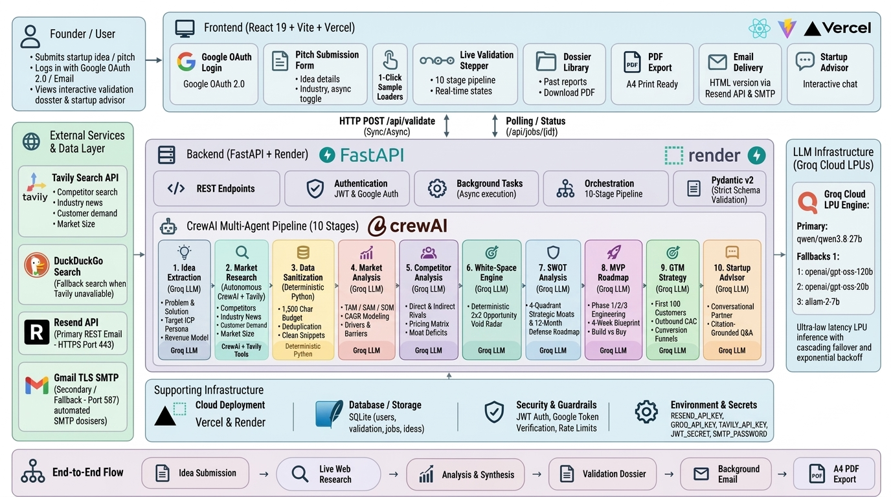

# VYIBE — Autonomous Venture Intelligence & Market Research Swarm
**Project Team Forge (ISB7.3)**

[](https://www.python.org/downloads/)
[](https://fastapi.tiangolo.com/)
[](https://react.dev/)
[](https://vitejs.dev/)
[](https://crewai.com)
[](https://tavily.com)
[](https://groq.com)
[](https://sqlite.org)
[](https://team-forge-frontend-one.vercel.app)
[](https://team-forge-backend.onrender.com)
[](LICENSE)

> **VYIBE** (*Validate Your Idea Before Execution*) is an autonomous multi-agent venture diligence engine. It transforms unvetted startup ideas, technical hypotheses, and business concepts into comprehensive, investor-grade market validation dossiers in under 60 seconds — grounded strictly in live empirical search data, not generic LLM flattery.

---

## 🌐 Live Deployments

- **Production Frontend**: [team-forge-frontend-one.vercel.app](https://team-forge-frontend-one.vercel.app)
- **Production Backend API**: [team-forge-backend.onrender.com](https://team-forge-backend.onrender.com)
- **Interactive API Docs (Swagger UI)**: [team-forge-backend.onrender.com/docs](https://team-forge-backend.onrender.com/docs)
- **API Health Check**: [team-forge-backend.onrender.com/api/health](https://team-forge-backend.onrender.com/api/health)

---

## 📌 Problem Statement & Why VYIBE

Over **90% of technology startups fail**, and the #1 leading cause remains **building products for which there is no genuine market need** (CB Insights).

| Dimension | Generic LLMs (ChatGPT / Claude) | VYIBE Multi-Agent Swarm |
| :--- | :--- | :--- |
| **Market Data Freshness** | Static training cutoff; blind to new entrants | Real-time live web tool-calling via Tavily across 4 search vectors |
| **Citation Verifiability** | Fabricated links or generic domain mentions | Exact source URLs, verified dates, publication names, and snippet quotes |
| **Competitor Discovery** | Returns famous incumbents (Google, Salesforce) | Extracts live direct/indirect rivals, seed-stage competitors, and pricing tiers |
| **Market Sizing (TAM/SAM)** | Hallucinates plausible-sounding billions | Triangulated from analyst reports (Gartner, Grand View Research) with CAGR |
| **Strategic Reasoning** | Generic advice ("Focus on marketing & sales") | Deterministic 2x2 White-Space matrix, SWOT roadmap, and MVP scoping |
| **Ongoing Diligence** | Context drifts after a few chat exchanges | Conversational advisor strictly grounded in active dossier citations |
| **Deliverables & Sharing** | Unformatted text blocks copied from a chat | One-click investor-grade PDF export and background email delivery |

---

## 🏛️ System Architecture & 10-Stage Pipeline



```
┌────────────────────────────────────────────────────────────────────────────────────────────────────────┐
│                                   CLIENT / PRESENTATION LAYER                                          │
│  React 19 + Vite SPA • Warm Editorial Research Canvas (#FAF8F5) • Responsive Executive Console         │
│  [Google OAuth / JWT] • [1-Click Sample Loaders] • [Live Agent Stepper] • [Interactive Advisor Drawer] │
│  [One-Click A4 PDF Dossier] • [Async Background Toggle] • [Dossier History Library]                    │
└───────────────────────────────────┬───────────────────────────────────▲────────────────────────────────┘
                                    │ POST /api/validate (Sync)         │ HTTP Polling /api/jobs/{id}
                                    │ POST /api/validate/async          │ SSE / JSON Dossier Payload
                                    │ POST /api/advisor/chat            │ JWT Session /api/auth/me
                                    ▼                                   │
┌───────────────────────────────────────────────────────────────────────┴────────────────────────────────┐
│                               FASTAPI BACKEND ORCHESTRATOR & AGENT SWARM                               │
├────────────────────────────────────────────────────────────────────────────────────────────────────────┤
│  Stage 1: IdeaExtractionAgent      ── Parse problem, core workflow, ICP, and vertical keywords         │
│  Stage 2: MarketResearchAgent      ── Autonomous Tavily search tool-calling (Comp, Demand, Size, News) │
│  Stage 3: DataRetrievalAgent       ── Deduplication, 1,500 char snippet budgeting & sanitization       │
│  Stage 4: MarketAnalysisAgent      ── TAM/SAM/SOM sizing, CAGR, drivers, and user personas             │
│  Stage 5: CompetitorAnalysisAgent  ── Direct/indirect competitors, positioning, differentiation        │
│  Stage 6: WhiteSpaceEngine         ── Deterministic 2x2 opportunity gap & unaddressed demand matrix    │
│  Stage 7: SWOTAgent                ── 4-quadrant strategic matrix synthesized from real evidence       │
│  Stage 8: MVPAgent                 ── 3-phase product roadmap, feature prioritization & risk triage    │
│  Stage 9: GTMAgent                 ── Multi-channel customer acquisition strategy & launch milestones   │
│  Stage 10: StartupAdvisorAgent     ── Multi-turn interactive venture partner grounded in active report  │
└───────────────────────────────────┬───────────────────────────────────┬────────────────────────────────┘
                                    │                                   │
              ┌─────────────────────▼───────────────┐   ┌───────────────▼──────────────────────────┐
              │   EXTERNAL RESEARCH & EMAIL LAYER   │   │     PERSISTENCE & INFERENCE LAYER        │
              ├─────────────────────────────────────┤   ├──────────────────────────────────────────┤
              │ • Tavily AI Search (Primary RAG)    │   │ • Groq Cloud LPUs (Qwen 3.8 / GPT-OSS)   │
              │ • DuckDuckGo (Fallback Search)      │   │ • SQLite DB (team_forge.db: Users & Jobs)│
              │ • Gmail TLS SMTP / Resend API       │   │ • LRU In-Memory Bounded Session Cache    │
              │ • Google Identity Services (OAuth)  │   │ • 14 Externalized Markdown Prompts       │
              └─────────────────────────────────────┘   └──────────────────────────────────────────┘
```

---

## 🚀 Key Engineering Innovations

### 1. Executive Venture Diligence Console
- **Interactive Sample Chips**: Pre-populates proven test scenarios (`LegalTech AI`, `Fleet Telematics`, `MedTech Denial AI`) with a single click.
- **Multi-Parameter Calibration**: Captures startup thesis, optional product name, target industry, and specific customer persona for high-precision search filtering.
- **Micro-Animations**: Custom cubic-bezier transitions (`cubic-bezier(0.16, 1, 0.3, 1)`), live pulsing engine indicators, and responsive input elevation.

### 2. Autonomous Multi-Vector Tool-Calling via CrewAI
- `MarketResearchAgent` autonomously formulates search queries across 4 distinct research vectors:
  1. `search_competitors`: Discovers direct alternatives, indirect competitors, and legacy workflows.
  2. `search_customer_demand`: Locates complaints, feature requests, and forum discussions (Reddit, G2, ProductHunt).
  3. `search_market_size`: Retrieves analyst CAGR figures, TAM estimates, and market growth drivers.
  4. `search_industry_news`: Identifies regulatory shifts, funding rounds, and recent industry headwinds.
- **Selective Autonomy**: Automatically executes consumer demand searches for B2C/hybrid concepts while bypassing irrelevant B2C queries for pure enterprise B2B models.

### 3. Anti-Hallucination Grounding & Evidence Budgeting
- **Snippet Context Budgeting**: Compiles search results into a clean 1,500-character context budget per citation, ensuring downstream agents analyze real competitor feature sets without context truncation.
- **Honest Grounding Notice**: When live web search returns zero citations for a specific sector, the system displays an explicit amber notice rather than synthesizing fake data.

### 4. Asynchronous Background Execution & Email Delivery
- **Zero-Wait Diligence**: Users can launch validations asynchronously (`POST /api/validate/async`) and safely close their browser tab.
- **Automated Delivery**: Compiles the executive dossier into responsive HTML email reports delivered directly to the founder's inbox via TLS SMTP / Resend.
- **Live Polling**: Real-time status checks via `GET /api/jobs/{job_id}` allow seamless automatic page transitions when research completes.

### 5. Interactive Conversational Venture Advisor
- Built-in slide-out advisor drawer powered by `POST /api/advisor/chat`.
- Founders can ask targeted follow-up questions ("*How should I price the Enterprise tier?*", "*What is my defensibility against Competitor X?*") with responses strictly grounded in their active dossier.

---

## 🛠️ Complete Technology Stack & Tooling Matrix

| Layer / Domain | Technology / Tool | Version / Spec | Role in VYIBE Platform |
| :--- | :--- | :--- | :--- |
| **Frontend Framework** | **React** | `18.3.1` | Single-page application orchestrating the diligence console, report viewer, and advisor drawer. |
| **Bundler & Tooling** | **Vite** | `5.4.8` | Lightning-fast development HMR and optimized production bundle compilation. |
| **Styling & Design** | **Bespoke Vanilla CSS** | Custom Tokens | Executive research canvas (`#FAF8F5`), high-contrast typography, and `@keyframes` micro-animations. |
| **Authentication** | **Google Identity Services** | OAuth 2.0 | One-Tap Google authentication with client-side token exchange and JWT verification. |
| **Backend API Gateway** | **FastAPI** | `0.115.0` | High-performance asynchronous REST API framework running on Uvicorn ASGI server. |
| **Schema Validation** | **Pydantic v2** | `2.9.2` | Strict runtime request/response contracts, data serialization, and input sanitation. |
| **Multi-Agent Engine** | **CrewAI** | `1.15.0` | Orchestrates autonomous agent tool-calling, goal-seeking behavior, and pipeline sequencing. |
| **Real-Time Web Search** | **Tavily AI Search API** | `0.3.0` | Autonomous multi-vector web RAG across Competitors, Market Sizing, Demand, and News. |
| **Failover Search Engine** | **DuckDuckGo Lite** | REST Endpoint | Zero-config, zero-key deterministic fallback search if primary search is degraded. |
| **Inference Hardware** | **Groq Cloud LPUs** | Groq SDK `0.9.0` | Custom silicon Language Processing Units delivering 500+ tokens/sec analytical inference. |
| **Foundation LLMs** | **Qwen 3.8 27B / GPT-OSS** | Groq Model Pool | Cascading failover: `qwen/qwen3.8-27b` ➔ `openai/gpt-oss-120b` ➔ `openai/gpt-oss-20b` ➔ `allam-2-7b`. |
| **Relational Database** | **SQLite3** | `team_forge.db` | Embedded zero-cost ACID relational store for user profiles, validation jobs, and history. |
| **Security & Passwords** | **PyJWT & Bcrypt** | `PyJWT 2.8`, `bcrypt 4.0` | Stateless HMAC-SHA256 session tokens and salted password hashing. |
| **Email Automation** | **Gmail TLS SMTP & Resend** | Port `587` TLS | Non-blocking background worker dispatching responsive HTML dossiers directly to inboxes. |
| **Cloud Hosting (Web)** | **Vercel** | Edge Network | Global edge delivery, automatic SSL, and atomic zero-downtime frontend deployments. |
| **Cloud Hosting (API)** | **Render** | Python Web Service | Managed containerized production ASGI backend deployment with automatic CORS and health checks. |

---

## 📁 Repository Structure

```
team-forge/
├── backend/                    # FastAPI backend & multi-agent pipeline
│   ├── agents/                 # Specialized analytical agents (Extraction, Market, SWOT, MVP, etc.)
│   ├── crew/                   # CrewAI orchestrator, tasks, and Tavily search tools
│   ├── data/                   # Embedded SQLite store (team_forge.db) and email templates
│   ├── db/                     # SQLite database connection, models, and migrations
│   ├── prompts/                # 14 Externalized Markdown prompt templates (*_system.md, *_task.md)
│   ├── schemas/                # Pydantic v2 data contracts for requests, responses, and validation
│   ├── scripts/                # Verification, benchmark, and regression test scripts
│   ├── services/               # White-Space engine, LLM client, email service, and sanitizers
│   ├── tests/                  # Pytest unit and integration test suites
│   ├── config.py               # Environment configuration and API keys
│   ├── main.py                 # FastAPI application routes & CORS configuration
│   └── requirements.txt        # Python backend dependencies
├── frontend/                   # React 18 + Vite frontend application
│   ├── public/                 # Static assets, SVG icons, and favicon manifest
│   ├── src/
│   │   ├── components/         # Presentation components (Console, Dossier, Advisor, Modals, etc.)
│   │   ├── context/            # AuthContext (Google OAuth & JWT session state)
│   │   ├── App.css             # Executive editorial styling and micro-animations
│   │   ├── App.jsx             # Main application controller and routing guard
│   │   ├── index.css           # Design tokens, typography rules, and CSS variables
│   │   └── main.jsx            # React root mount
│   ├── package.json            # Node.js dependencies (React 18.3.1, Vite 5.4.8)
│   └── vite.config.js          # Vite bundler configuration
├── docs/                       # 14 Comprehensive technical & academic documentation files
│   ├── images/                 # High-resolution system architecture blueprints
│   └── *.md                    # Individual engineering chapters (SRS, AI/ML, API, Security)
├── ARCHITECTURE.md             # Complete system architecture blueprint with embedded diagram
├── PRESENTATION_PPT.md         # 15-Slide Presentation Deck Outline for Claude & Slide Generators
├── PROJECT_EXPLANATION.md      # Deep-dive architectural and engineering explanation
└── README.md                   # Project overview and quickstart guide (this file)
```

---

## ⚡ Quickstart Guide

### 1. Prerequisites
- **Python**: 3.11 or higher
- **Node.js**: 18.0.0 or higher
- **API Keys**:
  - `GROQ_API_KEY` ([console.groq.com](https://console.groq.com))
  - `TAVILY_API_KEY` ([tavily.com](https://tavily.com))
  - *Optional*: `GOOGLE_CLIENT_ID` for Google One-Tap authentication
  - *Optional*: `SMTP_USERNAME` & `SMTP_PASSWORD` for automated email delivery

---

### 2. Backend Setup

```bash
# 1. Clone the repository
git clone https://github.com/sanjaykumar-xe/team-forge-ISB7.3.git
cd team-forge-ISB7.3/backend

# 2. Create and activate a virtual environment
python -m venv venv
# Windows:
venv\Scripts\activate
# macOS/Linux:
source venv/bin/activate

# 3. Install dependencies
pip install -r requirements.txt

# 4. Configure environment variables
cp .env.example .env
# Edit .env and supply your GROQ_API_KEY and TAVILY_API_KEY

# 5. Start the FastAPI development server
uvicorn main:app --reload --host 127.0.0.1 --port 8000
```
API Documentation will be available at `http://127.0.0.1:8000/docs`.

---

### 3. Frontend Setup

```bash
# 1. In a separate terminal, navigate to frontend
cd frontend

# 2. Install dependencies
npm install

# 3. Start the Vite dev server
npm run dev
```
Open your browser at `http://localhost:5173`.

---

## 🧪 Testing & Verification

```bash
# Run unit & agent integration test suite
pytest backend/tests -v

# Run smoke test on core FastAPI endpoints
python backend/scripts/smoke_test.py

# Verify CrewAI autonomous tool-calling pipeline
python backend/scripts/run_agentic_verification.py

# Run 5-idea multi-domain regression benchmark
python backend/scripts/run_5_regression_ideas.py

# Validate frontend production build
cd frontend && npm run build
```

---

## 📊 Core API Endpoints

| Method | Endpoint | Description |
| :--- | :--- | :--- |
| `POST` | `/api/validate` | Synchronous validation: executes full 10-stage pipeline and returns complete dossier. |
| `POST` | `/api/validate/async` | Asynchronous validation: enqueues background job, returns immediately with `job_id`. |
| `GET` | `/api/jobs/{job_id}` | Polls status of background validation (`queued`, `running`, `completed`, `failed`). |
| `POST` | `/api/advisor/chat` | Interactive conversational query grounded in the active dossier context. |
| `POST` | `/api/auth/google` | Verifies Google OAuth token, creates/logs in founder, issues 7-day JWT. |
| `GET` | `/api/auth/me` | Validates session token and returns active founder profile and report history. |
| `GET` | `/api/reports/my` | Retrieves all previously generated dossiers for the authenticated founder. |

---

## 📚 Supplementary Documentation

- **[`PROJECT_EXPLANATION.md`](PROJECT_EXPLANATION.md)**: Exhaustive engineering explanation of every agent, prompt strategy, data model, and design decision.
- **[`PRESENTATION_PPT.md`](PRESENTATION_PPT.md)**: 15-Slide Presentation Deck ready for Claude and slide creation tools.
- **[`docs/`](docs/)**: Full 14-part academic and technical documentation suite.

---

## 📄 License

This project is licensed under the MIT License — see the [LICENSE](LICENSE) file for details.
