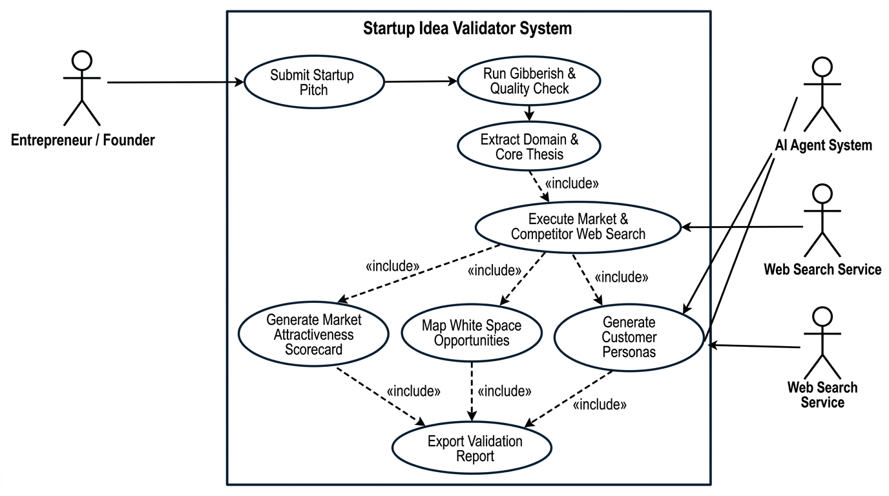
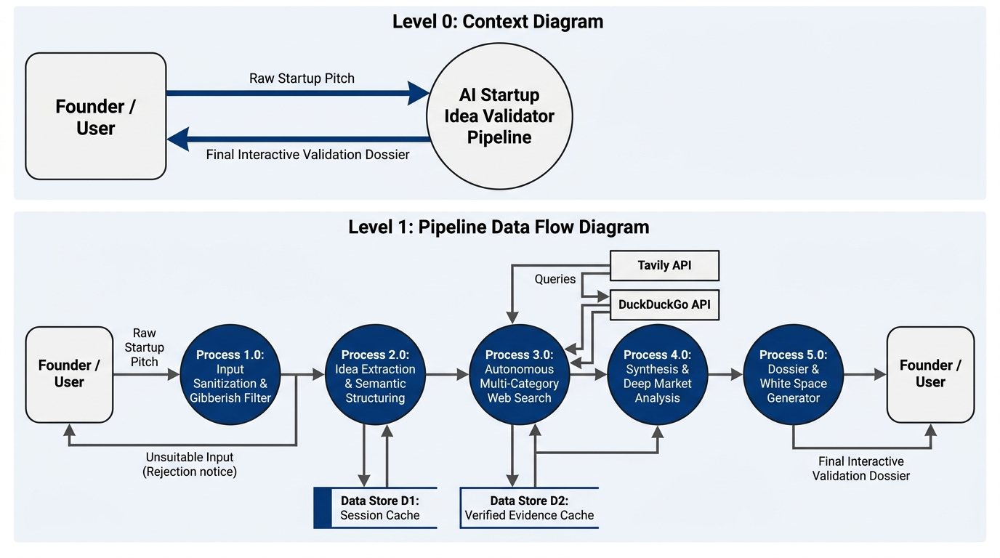
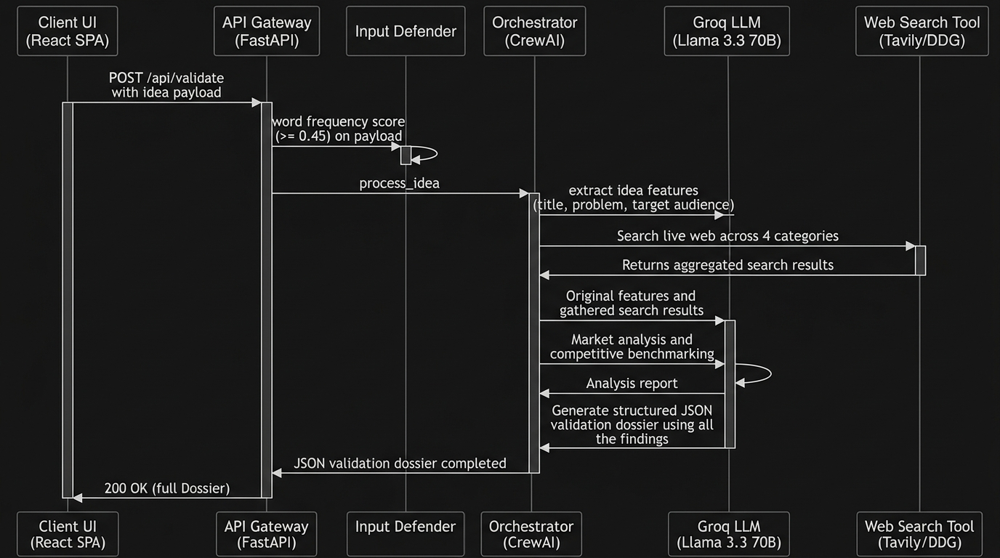
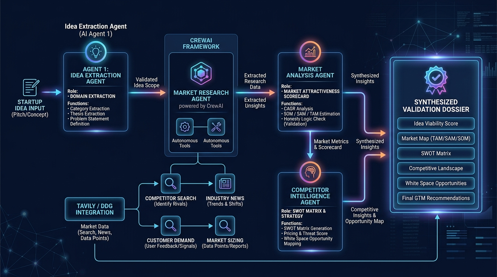
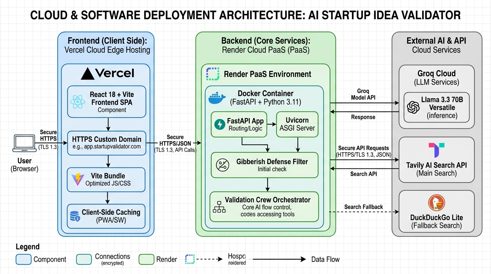
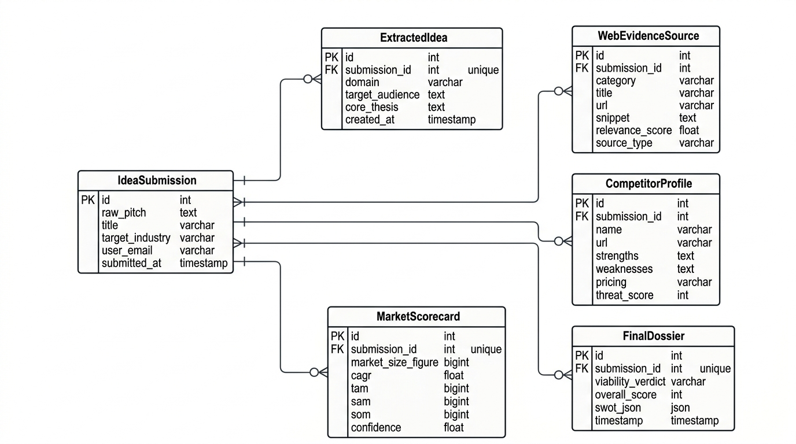
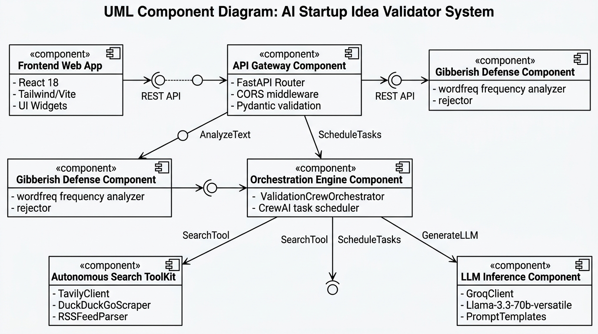
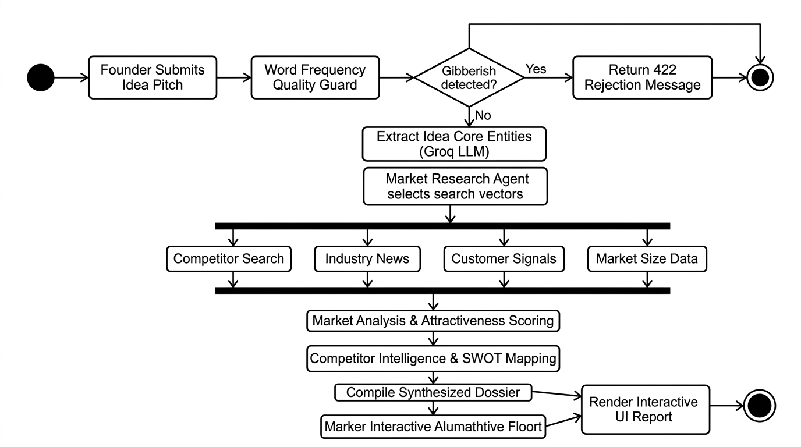
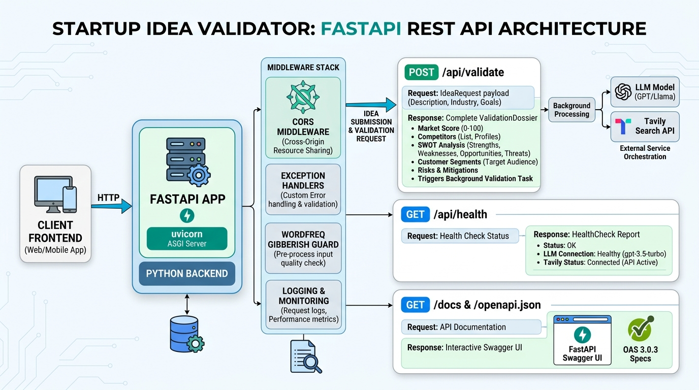
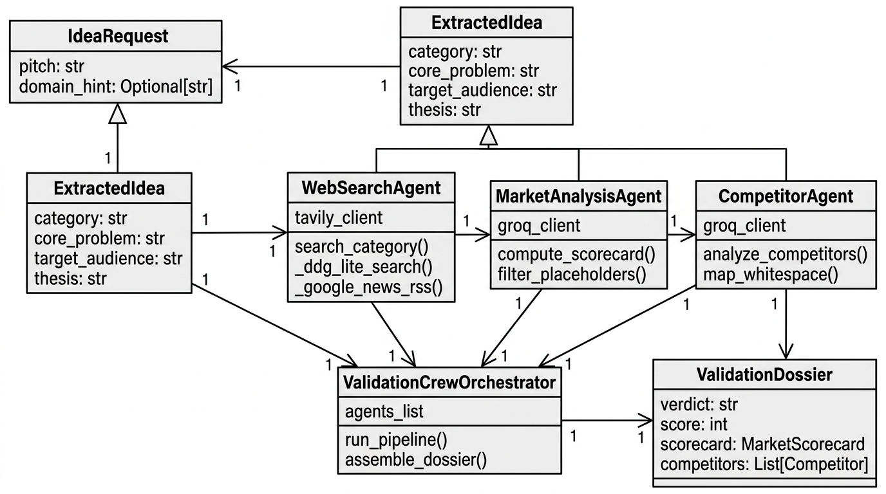

# 12. System Architecture & Engineering Diagrams Gallery

This document serves as the visual engineering gallery for the **VYIBE (Validate Your Idea Before Execution)** platform (Team Forge ISB7.3). It brings together all architectural, structural, behavioral, data, and deployment blueprints governing the platform.

---

## 🏛️ Diagram 1: High-Level System Architecture Blueprint

Comprehensive overview of the client presentation layer, API gateway, 10-stage multi-agent research pipeline, external research layer, Groq LPU inference pool, and supporting persistence infrastructure.

- **Presentation Layer**: React 18 + Vite SPA deployed on Vercel Edge with Google OAuth 2.0 and responsive executive console.
- **Backend Orchestrator**: FastAPI on Render with native asynchronous `BackgroundTasks`, JWT auth, and strict Pydantic v2 schemas.
- **Agent Pipeline**: 10 sequential analytical stages coordinated via CrewAI 1.15.
- **Inference Tier**: Groq Cloud LPUs with cascading failover (`qwen/qwen3.8-27b` ➔ `openai/gpt-oss-120b` ➔ `openai/gpt-oss-20b` ➔ `allam-2-7b`).
- **Research Tier**: Tavily AI Search API with DuckDuckGo Lite deterministic fallback.

---

## 👤 Diagram 2: System Use Case Diagram

Illustrates interactions between primary actors (Founders, Venture Analysts, Evaluators) and the core platform capabilities.

- **Pitch Submission & Calibration**: Founders supply problem, solution, target persona, and industry vertical.
- **Diligence Pipeline Execution**: Real-time progress monitoring through 10 stages.
- **Report Consumption**: Exploration of TAM/SAM/SOM, Competitor Positioning, 2x2 White-Space Radar, and SWOT matrices.
- **Interactive Advisory**: Multi-turn dialogue with the Startup Advisor grounded in report citations.
- **Report Distribution**: A4 print-ready PDF export and asynchronous transactional email delivery.

---

## 🔄 Diagram 3: Data Flow Diagram (DFD Pipeline)

Traces data movement from raw natural language input through extraction, multi-vector web retrieval, deterministic sanitization, analytical synthesis, and report caching.

- **Level 0 (Context)**: Founder Pitch ➔ Validation Swarm ➔ Validated Venture Dossier.
- **Level 1 (Subsystems)**: Ingestion & Filtering ➔ Multi-Vector Web Search ➔ Context Budgeting ➔ Strategic Modeling ➔ SQLite Relational Storage.
- **Data Stores**: In-memory bounded LRU cache (`MAX_CACHE_SIZE = 100`) and SQLite database (`team_forge.db`).

---

## ⏱️ Diagram 4: System Sequence Diagram

Chronological message exchange sequence between Client, FastAPI API Gateway, CrewAI Orchestrator, Tavily Search, Groq LPUs, and SQLite Database.

- **Sync Path**: Direct HTTP request/response for rapid interactive validation.
- **Async Path**: HTTP 202 Accepted with immediate `job_id`, background execution worker, and status polling (`GET /api/jobs/{id}`).
- **Chat Path**: Follow-up queries processed against cached validation state without re-running web search.

---

## 🤖 Diagram 5: Multi-Agent Architecture Diagram

Deep-dive into the 10 specialized intelligence agents, their system prompts, tool bindings, and contract schemas.

1. **Idea Extraction Agent**: Normalizes raw input into structured domain parameters.
2. **Market Research Agent**: CrewAI agent executing autonomous search tool-calling.
3. **Data Retrieval Agent**: Deterministic Python URL deduplication and 1,500-char context budgeting.
4. **Market Opportunity Agent**: TAM/SAM/SOM sizing and user personas.
5. **Competitor Discovery Agent**: Direct/indirect alternatives and pricing matrix.
6. **White-Space Engine**: Mathematical 2x2 opportunity gap analysis.
7. **SWOT & Risk Agent**: 4-quadrant strategic matrix and risk mitigations.
8. **MVP Scoping Agent**: 3-phase engineering roadmap and feature priorities.
9. **GTM Strategy Agent**: Acquisition channels, conversion funnels, and CAC expectations.
10. **Startup Advisor Agent**: Multi-turn conversational partner grounded in dossier citations.

---

## 🌐 Diagram 6: Cloud Deployment & Infrastructure Topology

Visualizes the production hybrid cloud deployment across Vercel Edge Network, Render Web Service, Groq LPUs, and external APIs.

- **Frontend**: Vercel Edge Network with global CDN caching and automatic HTTPS.
- **Backend**: Render Python 3.11 web service with containerized Uvicorn ASGI server.
- **Database**: Local embedded SQLite store persisted on Render persistent storage.
- **External APIs**: HTTPS REST calls to Groq Cloud LPUs, Tavily Search, and Gmail TLS SMTP (Port 587).

---

## 🗄️ Diagram 7: Entity-Relationship (ER) Database Diagram

Relational schema design for user accounts, session tokens, and asynchronous validation jobs.

- **`users` Table**:
  - `id` (TEXT, PK): Unique user UUID.
  - `email` (TEXT, Unique): User email address.
  - `name` (TEXT): Founder full name.
  - `avatar_url` (TEXT): Google profile picture URL.
  - `password_hash` (TEXT): Bcrypt salted password hash.
  - `auth_provider` (TEXT): `'google'` or `'email'`.
  - `created_at` (TIMESTAMP): Account registration timestamp.
- **`validation_jobs` Table**:
  - `job_id` (TEXT, PK): Unique validation job UUID.
  - `user_id` (TEXT, FK): References `users(id)`.
  - `idea_text` (TEXT): Natural language pitch input.
  - `email` (TEXT): Target email for report dispatch.
  - `status` (TEXT): `'queued'`, `'processing'`, `'completed'`, `'failed'`.
  - `result_json` (TEXT): Complete serialized `ValidationResponse` payload.
  - `error_message` (TEXT): Error trace if job failed.
  - `created_at` & `completed_at` (TIMESTAMP): Execution tracking timestamps.

---

## 🧩 Diagram 8: Component Architecture Diagram

Internal component hierarchy of the FastAPI application showing separation of concerns between routers, services, schemas, and agents.

- **Presentation Layer**: React Components (`LandingPage`, `LoginPage`, `StartupAdvisorChat`, `UserReportsModal`, `DossierView`).
- **Gateway Layer**: FastAPI Routers (`/api/validate`, `/api/advisor`, `/api/auth`, `/api/jobs`).
- **Orchestration Layer**: `ValidationCrewOrchestrator` managing sequential agent handoffs.
- **Data Access Layer**: `database.py` managing SQLite connections and schema migrations.

---

## ⚡ Diagram 9: Activity Flow Diagram

State machine and decision logic followed by the validation engine during pitch processing.

- **Validation Branch**: Verifies English token density ($\ge 0.45$). Rejects gibberish input before executing API calls.
- **Search Branch**: Evaluates B2B vs B2C domains to selectively invoke consumer demand forums or industry analyst reports.
- **Failover Branch**: Automatically catches HTTP 429 rate limits and retries with exponential backoff on backup Groq models.

---

## 🔌 Diagram 10: API Architecture Diagram

RESTful endpoint specifications, HTTP verbs, payload contracts, and status response codes.

- `POST /api/validate` (200 OK): Synchronous diligence execution.
- `POST /api/validate/async` (202 Accepted): Non-blocking asynchronous task launch.
- `POST /api/advisor/chat` (200 OK): Multi-turn conversational sidecar.
- `POST /api/auth/google` (200 OK): Google token exchange for JWT session.
- `GET /api/jobs/{id}` (200 OK): Real-time polling for job completion.
- `GET /api/health` (200 OK): Uptime and health monitoring.

---

## 📐 Diagram 11: Class Diagram & Pydantic Data Contracts

Object-oriented class hierarchy and Pydantic v2 data models enforcing strict schema contracts.

- `IdeaSubmission`: Input validation contract.
- `SourceRecord`: Normalized citation contract with relevance scores.
- `MarketAnalysisResult`: TAM/SAM/SOM, CAGR, and personas contract.
- `CompetitorAnalysisResult`: Competitor records and comparison matrix.
- `WhiteSpaceAnalysisResult`: Opportunity gap cards with confidence scores.
- `SWOTAnalysisResult`: 4-quadrant strategic matrix.
- `MVPRecommendation`: Phased roadmap and technical risk triage.
- `GTMStrategy`: Channels, funnels, and milestone schedule.
- `ValidationResponse`: Composite root contract serialized to JSON.
